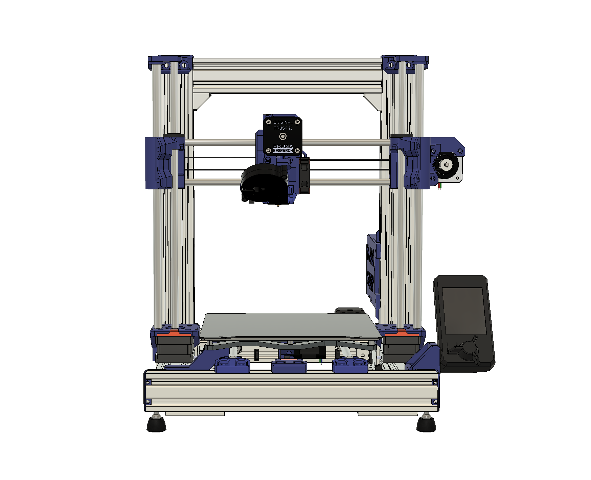

# Prusa-MINI-bear-mod-Z10
Bear mod adaptation for Prusa MINI(+) based on original 10mm Z rods

## ---------------Work in Progress---------------

`Parts are currently being printed. An update will follow soon with the realized mod.`

## Features

- Compatible with Prusa MINI and MINI+
- Supported (dual) Z-axis based on the stock 10mm rods
- MK3S printhead
- Reuse of as many parts as possible
- Increased frame robustsness
- Reduced noise levels (to be tested)
- Maintenance friendly
- Compatible with stock firmware (verification pending)
- Open-source

## Background

There are quite a few models and tutorials online (mainly in [Printables](https://www.printables.com/search/all?q=prusa%20bear%20mini)) to build your Prusa Mini Bear mod, but as soon as you try to dive into versions and part compatibility, it becomes chaotic. Before printing, I wanted to ensure that all parts are well aligned and compatible with each other, but as far as I could find, there was no published CAD version with a complete model. Either I had to make a collection and hope for the best, or work on my own remix.

Main issues I observed:

- X and Y belts not running parallel to the axis.
- No stock Prusa extruder R6 version with proper probe offsets.
- No CAD with 10mm Z rods to verify.
- Z rods where not properly aligned with X axis holders and top Z brackets.

To fix these, I did the necessary modifications to the Fusion 360 designs I could find (see credits), as well design several parts from scratch.

----

For the extruder, I started from the stock part as released by Prusa Research: https://github.com/prusa3d/Original-Prusa-i3

Parts that are not modified:

- Buddy board case (3DPGVA): [Link](https://github.com/prusa3d/Original-Prusa-MINI/blob/master/DOCUMENTATION/ELECTRONICS/mini-motor-kit.pdf)
- Y-rod-holders, Y-idler-tension, 2040 end caps (gregsaun) and cable clips: [Link](https://github.com/gregsaun/prusa_i3_bear_upgrade)

---

Pictures color coding (printed parts): 

Blue/orange: Non-stock (Bear and Mini-Bear) parts. 
Black: Can be used from the stock Prusa Mini.
Ready-to-print STL files will follow as soon as I print the parts and complete the transition. Moreover, if there is enough interest I will accommodate a guide for this version.

### Disclaimer

The Original Prusa Mini+ is an amazing little printer and as far as I am concerned the print quality is incredible for the price and ease of use. I chose to proceed with this build because as many others, I enjoy tinkering with 3D printers towards the possibility of improvement. In this case, towards a possibly more robust frame, which would (in theory at least) allow to maintain the same quality at higher accelerations with a direct-drive extruder to ease printing of flexible filaments. Keep in mind, as with any DYI assembly, there is always a chance of the final produced print quality to suffer, as it depends on the sourced hardware quality, part design and on the actual skills and experience put into building.

## Print settings

`To Follow`

## BOM

`To Follow`

## Manual

`To Follow (maybe)`

## License

All parts are licensed under the GNU GENERAL PUBLIC LICENSE, Version 3. For more details please check the LICENSE file.

## Credits and Inspiration
- [Prusa Research](https://www.prusa3d.com/) for all their contributions to the 3D printing community and open-source 3D printers.
- [Grégoire Saunier](https://github.com/gregsaun) for his work on the [Prusa MK3S upgrade](https://github.com/gregsaun/prusa_i3_bear_upgrade), including the [Bear X axis](https://github.com/gregsaun/bear_extruder_and_x_axis). Additionally, credits are given to the original developers of the projects and products as cited by Grégoire Saunier.
- [3DPGVA](https://github.com/3DPGVA) for his [Bear adaptation](https://www.printables.com/model/37939-prusa-mini-mk3s-bear-ultra-upgraded) for Prusa MINI and [Buddy board case](https://www.printables.com/model/36612-prusamini-buddy-board-case-for-mk3s-like).
- [Tomson](https://www.printables.com/social/88572-tomson/models?o=download_count) for providing the 10mm Z idler [source files](https://www.printables.com/model/64032-mini-bear-remixsmokistylewith-alternative-z-rod/files) I started with.

