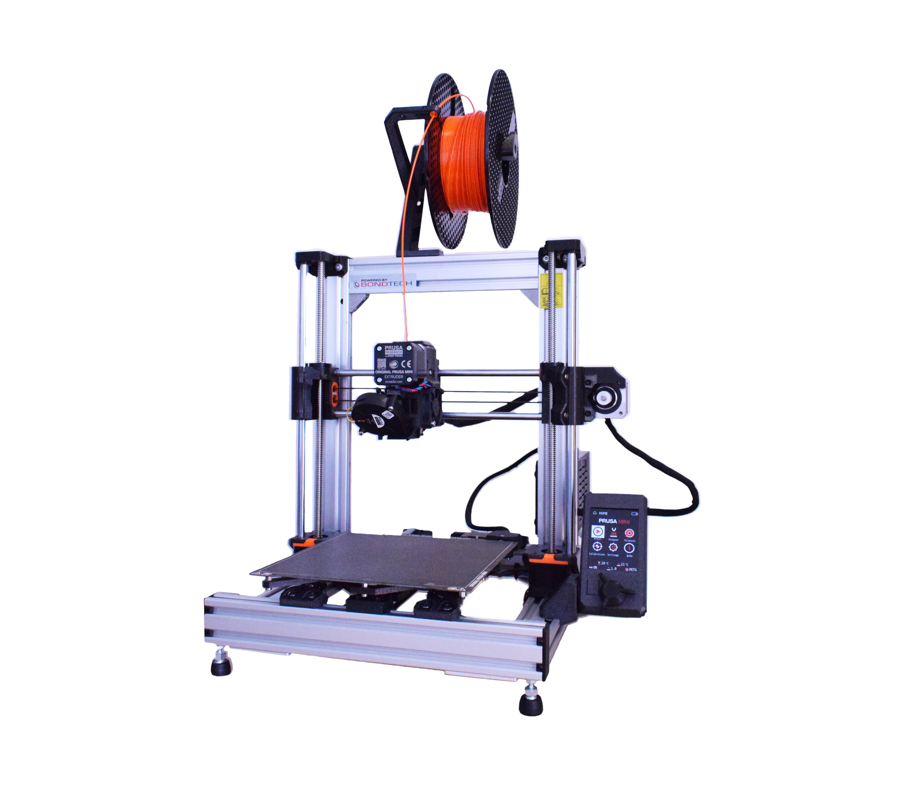

# Prusa-MINI-bear-mod-Z10

## Table of Contents
1. [Introduction](#Introduction) 
1. [Features](#Features)
1. [Background](#Background)
1. [Disclaimer](#Disclaimer)
1. [Post MK4 release thoughts](#Post-MK4-release-thoughts)
1. [BOM](#BOM)
1. [Manual](#Manual)
1. [Firmware](#Firmware)
1. [Print profiles](#Print-profiles)
1. [License](#License)
1. [Credits and Inspiration](#Credits-and-Inspiration)

## Introduction

Bear mod adaptation for Prusa MINI(+) based on 10mm Z rods.

## Features

- Compatible with Prusa MINI and MINI+
- Supported (dual) Z-axis based on the stock 10mm rods
- MK3S printhead w/ Filament Sensor
- Reuse of as many non-printed parts as possible[^1]
- Increased frame robustsness
- Maintenance friendly
- Reduced noise levels
- Compatible with stock firmware (with few limitation, see [Firmware](#Firmware) section)
- Open-source

[^1]: Z rods are the only non-printed hardware part that will need to be modified and cut to length (311mm).

## Background

There are quite a few models and tutorials online (mainly in [Printables](https://www.printables.com/search/all?q=prusa%20bear%20mini)) to build your Prusa Mini Bear mod, but as soon as you try to dive into versions and part compatibility, it becomes chaotic. Before printing, I wanted to ensure that all parts are well aligned and compatible with each other, but as far as I could find, there was no published CAD version with a complete model. Either I had to make a collection and hope for the best, or work on my own remix.

Main issues I observed:

- X and Y belts not running parallel to the axis.
- No stock Prusa extruder R6 version with proper probe offsets.
- No CAD with 10mm Z rods to verify.
- Z rods where not properly aligned with X axis holders and top Z brackets.

To fix these, I did the necessary modifications to the Fusion 360 designs I could find (see credits), as well design several parts from scratch.

----

For the extruder, I started from the stock part as released by Prusa Research: https://github.com/prusa3d/Original-Prusa-i3

Parts that are not modified:

- Buddy board case (3DPGVA): [Link](https://github.com/prusa3d/Original-Prusa-MINI/blob/master/DOCUMENTATION/ELECTRONICS/mini-motor-kit.pdf)
- Y-rod-holders, Y-idler-tension, 2040 end caps (gregsaun) and cable clips: [Link](https://github.com/gregsaun/prusa_i3_bear_upgrade)

---

Pictures color coding (printed parts): 

Blue/orange: Non-stock (Bear and Mini-Bear) parts. 
Black: Can be used from the stock Prusa Mini.
Ready-to-print STL files will follow as soon as I print the parts and complete the transition. Moreover, if there is enough interest I will accommodate a guide for this version.

### Disclaimer

The Original Prusa Mini+ is an amazing little printer and as far as I am concerned the print quality is incredible for the price and ease of use. I chose to proceed with this build because as many others, I enjoy tinkering with 3D printers towards the possibility of improvement. In this case, towards a possibly more robust frame, which would (in theory at least) allow to maintain the same quality at higher accelerations with a direct-drive extruder to ease printing of flexible filaments. Keep in mind, as with any DYI assembly, there is always a chance of the final produced print quality to suffer, as it depends on the sourced hardware quality, part design and on the actual skills and experience put into building.

## Post MK4 release thoughts

- From the mechanical side it appears that the MK4 X axis + Nextruder combo (assuming it will be sold separately) should be directly applicable in this mod, due to the 10mm Z rods.
- Firmware wise, significant modifications may be needed for the automatic layer calibration and load-cell interfacing.
- Input shaping: At the time of writing, I am not aware of how to connect an accelerometer to the MINI Buddy board.

## Print settings

All parts are printed in PETG at 0.2mm layer height with the QUALITY profile @ MINI. The only applied changes to the default prifile (see [Print profiles](#Print-profiles)) are:
- Perimeters = 3
- Infill density = 25%

The only exception from PETG is the printhead fan-shroud which is printed in ABS, using the same print settings.

## BOM

`To do`

## Manual

I following guides should provide most necessary guide steps. If there is further interest I will make another document for some small details.

- Frame, Y and Z axis: [Bear Lab Guides](https://guides.bear-lab.com/c/BearFrame_Assembly_Guide)
- E axis: [Prusa MK3S assembly guide](https://help.prusa3d.com/guide/5-e-axis-assembly_28536)
- Electronics: [Prusa MINI electronics assembly](https://help.prusa3d.com/guide/5-lcd-assembly-electronics_202703) - Step 19 for the overview of BUDDY board connections.

## Firmware

The goal of this mod is to make it compatible with the Original Prusa MINI(+) firmware, as to avoid the effort of maintaining a custom version.

Although the printer works directly after the mod, few features implemented at firmware level, are not compatible. Mainly, the `load/unload` scripts from the Filament section of the MINI screen.

Instead of using those, custom macros shall be used to perform load and unload filament actions. See [Print profiles](#Print-profiles) section.

The shortcoming is that these macros cannot be used while a job is running. If the filament runs out during a print, the factory default load/unload macros will be executed. That is fine for the unload function, but for the load phase I suggest to proceed as instructed in the screen **but** without actually inserting the filament to the extruder (only enough to register the filament with the sensor). Then only push the filament during the purging phase.

**Factory provided modifiable settings**

To properly use the MK3S the following two settings need to be changed directly from the MINI screen. The menu to change these is kind of hidden; to access select `Settings->HW Setup (Long press until sound)`:
- Z-axis length: 210
- Extruder steps per unit: 140
- Extruder dir: Wrong

Save and return.

## Print profiles

`Under construction`

Current draft versions under the PRINT_PROFILES folder.

## License

All parts are licensed under the GNU GENERAL PUBLIC LICENSE, Version 3. For more details please check the LICENSE file.

## Credits and Inspiration
- [Prusa Research](https://www.prusa3d.com/) for all their contributions to the 3D printing community and open-source 3D printers.
- [Grégoire Saunier](https://github.com/gregsaun) for his work on the [Prusa MK3S upgrade](https://github.com/gregsaun/prusa_i3_bear_upgrade), including the [Bear X axis](https://github.com/gregsaun/bear_extruder_and_x_axis). Additionally, credits are given to the original developers of the projects and products as cited by Grégoire Saunier. This readme file structure is also inspired by the same repo.
- [3DPGVA](https://github.com/3DPGVA) for his [Bear adaptation](https://www.printables.com/model/37939-prusa-mini-mk3s-bear-ultra-upgraded) for Prusa MINI and [Buddy board case](https://www.printables.com/model/36612-prusamini-buddy-board-case-for-mk3s-like).
- [Tomson](https://www.printables.com/social/88572-tomson/models?o=download_count) for providing the 10mm Z idler [source files](https://www.printables.com/model/64032-mini-bear-remixsmokistylewith-alternative-z-rod/files) I started with.

